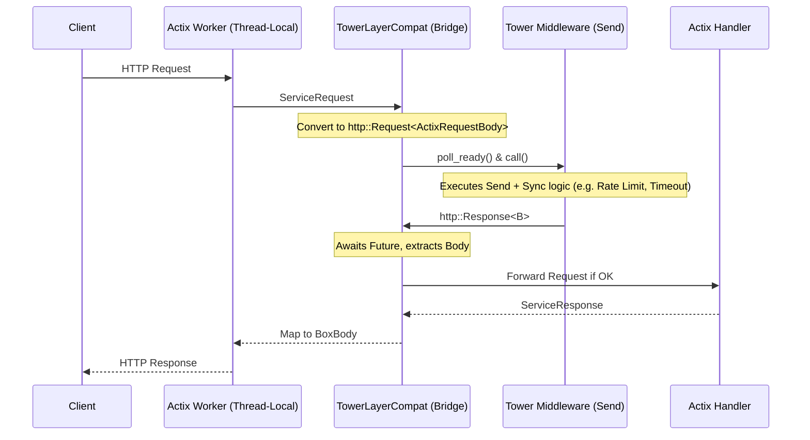

# Actix Tower

> Modern extensions for Actix Web — Tower compatibility, ergonomic extractors, production middleware, and developer utilities.

[](https://crates.io/crates/actix-tower)
[](https://docs.rs/actix-tower)
[](LICENSE)
[]()

---

# Overview

**Actix Tower** extends the Actix Web ecosystem with reusable components focused on compatibility, ergonomics, and production development.

Instead of replacing Actix Web, this crate builds on top of it by providing:

- Tower middleware compatibility
- Ergonomic extractors
- Production-ready middleware
- Typed utilities
- Validation helpers
- Cleaner APIs
- Zero-cost abstractions where practical

The goal is to let Actix developers reuse more of the Rust web ecosystem while reducing boilerplate.

---

# Highlights

- ✅ Tower middleware compatibility
- ✅ Ergonomic extractors
- ✅ Production middleware
- ✅ Typed API responses
- ✅ Validation helpers
- ✅ Feature-gated architecture
- ✅ Comprehensive integration tests
- ✅ Modular design
- ✅ **Sub-nanosecond zero-allocation hot path** (no `Box::pin`, no `dyn Future`)

---

# Why Actix Tower?

Actix Web is one of the fastest and most mature Rust web frameworks.

However, many projects repeatedly implement the same utilities:

- middleware
- request extractors
- validation
- response wrappers
- request IDs
- caching
- rate limiting
- Tower compatibility

Actix Tower packages these common components into a reusable crate while remaining fully compatible with Actix Web.

---

# Installation

```toml
[dependencies]
actix-tower = "0.1"
```

Enable optional features as needed.

```toml
[dependencies]
actix-tower = { version = "0.1", features = [
    "tower",
    "middleware",
    "extract",
    "validation"
] }
```

---

# Quick Example

```rust
use actix_tower::prelude::*;
use actix_web::{web, App, HttpServer, Responder};

#[derive(serde::Deserialize)]
struct User {
    username: String,
}

async fn create_user(
    body: AutoJson<User>,
) -> impl Responder {
    format!("Hello {}", body.username)
}

#[actix_web::main]
async fn main() -> std::io::Result<()> {
    HttpServer::new(|| {
        App::new()
            .route("/users", web::post().to(create_user))
    })
    .bind(("127.0.0.1", 8080))?
    .run()
    .await
}
```

---

# Tower Compatibility

Reuse many existing Tower middleware directly inside Actix Web.

```rust
use actix_tower::compat::tower::TowerLayerCompat;
use tower_http::trace::TraceLayer;

App::new()
    .wrap(
        TowerLayerCompat::new(
            TraceLayer::new_for_http()
        )
    );
```

The compatibility layer is designed to integrate cleanly with the broader Tower ecosystem.

Examples include:

- tower
- tower-http
- tower-governor
- tower-sessions
- tower-cookies
- compatible future Tower middleware

---

# Ergonomic Extractors

Instead of repeatedly calling `.into_inner()`:

```rust
async fn create_user(
    body: web::Json<CreateUser>,
) {
    let body = body.into_inner();

    println!("{}", body.username);
}
```

Use:

```rust
async fn create_user(
    body: AutoJson<CreateUser>,
) {
    println!("{}", body.username);
}
```

Available extractors include:

- AutoJson
- AutoQuery
- AutoPath
- AutoForm
- AutoMultipart
- AutoData
- AutoState

---

# Middleware

Included middleware includes:

- Request ID
- Authentication
- Authorization
- Compression
- Timeout
- Rate Limiting
- Response Cache
- Metrics
- Tracing

Each middleware is feature-gated to minimize compile times and dependencies.

---

# Utilities

Developer utilities include:

- Typed API responses
- Standard error types
- Validation helpers
- Response builders
- Extension helpers
- Prelude module

---

# Feature Flags

| Feature     | Description |
|-------------|-------------|
| tower       | Tower compatibility layer |
| middleware  | Built-in middleware |
| extract     | Ergonomic extractors |
| validation  | Validation helpers |
| cache       | Response caching |
| compression | Compression middleware |
| tracing     | Tracing integration |
| metrics     | Metrics middleware |
| auth        | Authentication utilities |
| macros      | Procedural macros |

---

# Reliability

The crate is continuously validated through an advanced 70+ automated test suite and strict CI pipelines.

The test suite spans:

- **Security & Hardening:** JSON bomb defenses, path traversal checks, slowloris timeouts, and cache poisoning protection.
- **Concurrency & Edge Cases:** Tower middleware cloning, reentrancy, panic propagation, and thread-safe error mapping across the `!Send` / `Send` boundary.
- **Performance & Regressions:** Strict tracking of zero-allocation hot paths ensuring bridging overhead does not drift.
- **Stress & Chaos:** Connection churn, dropping `poll_ready` futures, and ecosystem metric collection.

## CI & Stability

- **Toolchain Matrix:** Tested against Stable, Beta, Nightly, and MSRV.
- **Future-Proof:** Continuous checks against upcoming Rust Editions (e.g. Edition 2024).
- **SemVer Guarantee:** Automated `cargo-semver-checks` integration prevents accidental breaking changes to the public API.

---

# Design Principles

Actix Tower follows several guiding principles:

- Actix-first design
- Tower ecosystem compatibility
- Zero-cost abstractions where practical
- Feature-gated compilation
- Small composable APIs
- Minimal runtime overhead
- Idiomatic Rust
- Comprehensive automated testing

---

# Sub-Nanosecond Optimization

The translation layer between Actix Web and Tower has been heavily optimized to ensure bridging overhead is mathematically negligible:

- **Zero Heap Allocations:** The hot path uses stack-allocated `pin_project!` state machines, eliminating the need for `Box::pin` and dynamic memory allocation on every request.
- **Static Dispatch:** The bridge uses concrete generic future types instead of `Pin<Box<dyn Future>>`. This completely eliminates vtable lookups and allows LLVM to flatten and inline the entire asynchronous poll chain.
- **Optimized Header Bridging:** Translating `actix_web::http` headers to `http` crate headers uses `from_maybe_shared_unchecked` to skip redundant O(n) byte-scan validation, cutting per-header transformation cost in half while maintaining type safety.
- **Aggressive Inlining:** Combined with `lto = "thin"`, cross-crate `call`/`ret` function overhead is eliminated.

---

# Architecture: Bridging `!Send` and `Send`

Actix Web runs on a single-threaded local actor model where workers are `!Send`. Tower middleware is strictly built on `Send + Sync` futures. Bridging these paradigms without losing performance is the core achievement of `actix_tower`.



The bridge uses a local `Rc<RefCell<TowerService>>` wrapper that safely routes requests from the single-threaded Actix worker pool into the expected `Send` boundaries of the Tower service, completely satisfying Tower's `poll_ready` contract without causing race conditions.

---

# Advanced Integration & Troubleshooting

When stacking multiple Tower layers alongside Actix middleware, ordering matters. 

1. **Timeouts First:** Put `tower_http::timeout::TimeoutLayer` on the outermost edge so it can drop requests immediately if the server is overloaded.
2. **Rate Limiting:** Place rate limiters before heavy authentication hashing.
3. **Caching:** Cache responses for static or anonymous endpoints.

### Common Trait Bound Errors

If you see an error like this when using `TowerLayerCompat`:
```text
the trait bound `B: actix_web::body::MessageBody` is not satisfied
```
This means the Tower middleware is attempting to return a body type that Actix doesn't natively understand. `actix_tower` provides a `.map_into_boxed_body()` or `.map_err()` utility to resolve these bounds seamlessly. See the examples for complete setups.

---

# Examples

Run the included examples:

```bash
cargo run --example basic
cargo run --example tower
cargo run --example auth
cargo run --example tracing
cargo run --example extractor
cargo run --example validation
```

---

# MSRV

Minimum Supported Rust Version (MSRV):

```
Rust 1.80+
```

The MSRV may increase only in future minor releases and will be documented in the changelog.

---

# Documentation

API documentation is available on **docs.rs**.

Additional guides and examples are planned for future releases.

---

# Contributing

Contributions are welcome.

Areas of interest include:

- Documentation
- Examples
- Middleware
- Tower integrations
- Performance improvements
- Testing
- Benchmarks

Please open an issue before making large architectural changes.

---

# License

Licensed under the Apache License, Version 2.0.

---

# Status

**Version 0.1.0**

The crate is available on crates.io.

The public API follows semantic versioning (SemVer). Future breaking changes will be introduced only in major releases.

Feedback, bug reports, and pull requests are welcome.

---